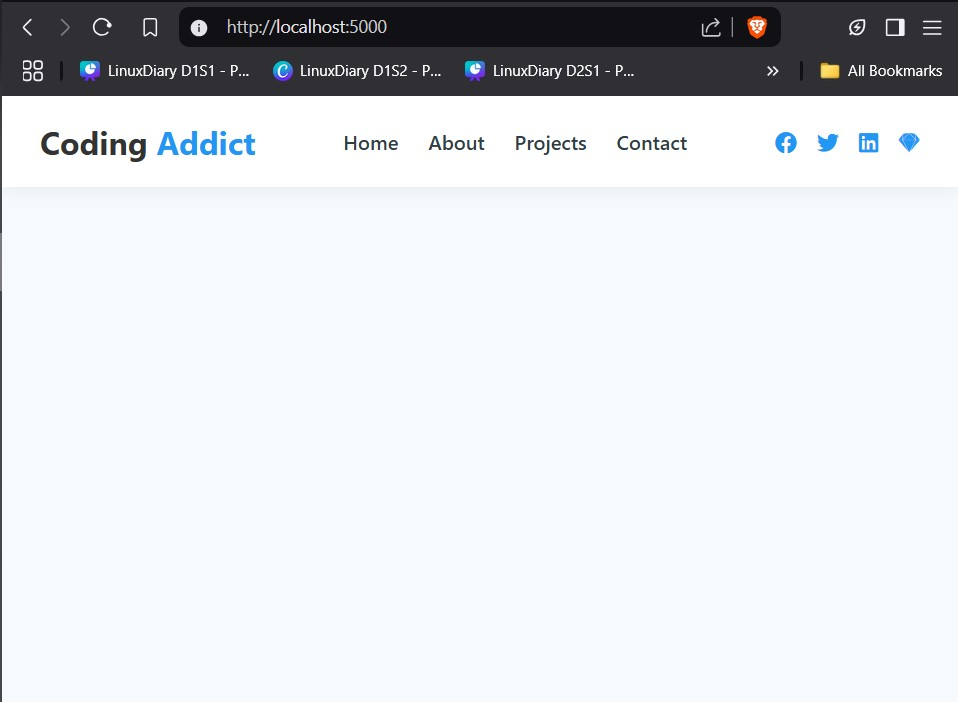

# Navbar App 🚀

A modern, responsive navigation bar built using **React**. This project showcases a simple yet elegant navbar design with smooth transitions, dynamic link rendering, and optional social media icons and is inspired by [John Smilga's GitHub Repo](https://github.com/john-smilga/node-express-course/tree/main/02-express-tutorial/navbar-app). 

## 📋 Features

- Responsive design for mobile and desktop views
- Dynamic rendering of nav links
- Toggleable menu for smaller screens (hamburger menu)
- Easy to customize and extend
- Clean and minimal UI

## 🛠️ Tech Stack

- **React** – JavaScript library for building user interfaces
- **Node** – JavaScript runtime for development tooling and server-side support 
- **CSS** – For styling the components

## 📸 Demo



## 🚀 Getting Started

To run this project locally:

```bash
git clone https://github.com/pushkar009/MERN-projects.git
cd MERN-projects
cd navbar-app
npm install
npm start
